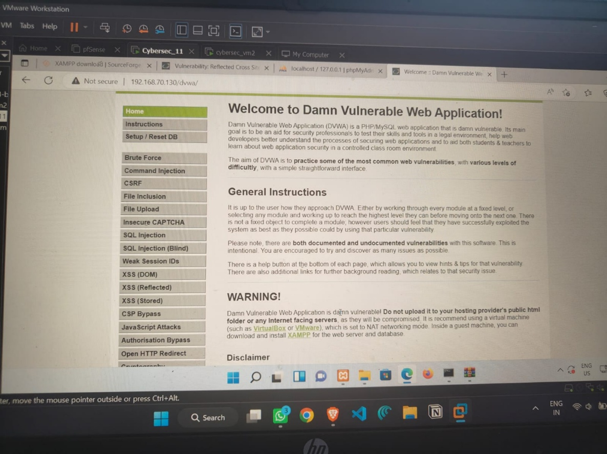
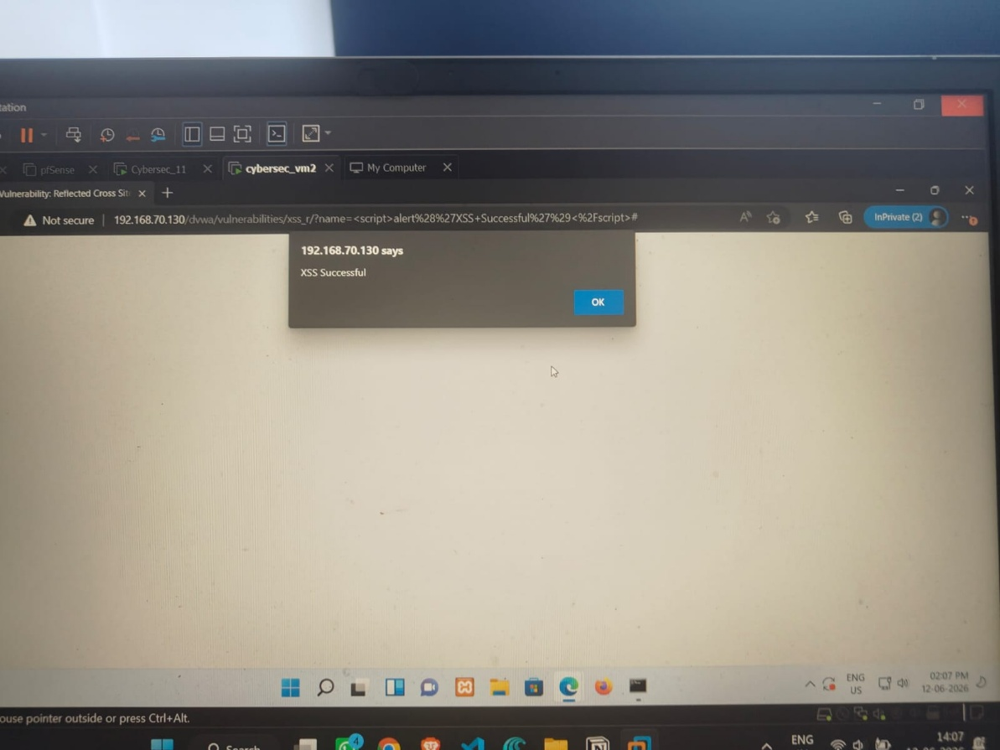
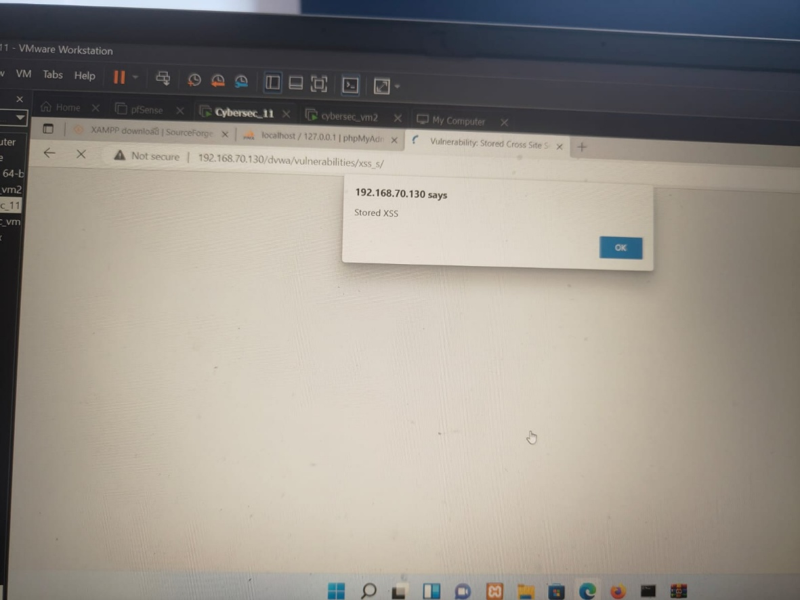

# Stored Cross Site Scripting (XSS) Lab using DVWA

A hands on web application security lab demonstrating a **Stored Cross Site Scripting (XSS)** vulnerability using **Damn Vulnerable Web Application (DVWA)** in a controlled virtual environment.

This project documents the complete attack workflow, from environment setup and vulnerability exploitation to impact analysis and mitigation techniques. It was performed as part of practical cybersecurity training to gain experience with common web application vulnerabilities and secure coding practices.

---

## Overview

Stored Cross Site Scripting (Stored XSS) occurs when malicious JavaScript is permanently stored by a vulnerable application and later executed in the browsers of other users.

In this lab, a vulnerable DVWA application was configured on a virtual machine. A malicious JavaScript payload was injected into the application and successfully executed when the vulnerable page was accessed.

---

## Objectives

- Understand how Stored XSS vulnerabilities work
- Configure a vulnerable web application in a controlled environment
- Perform a Stored XSS attack
- Analyze the impact of malicious script execution
- Study mitigation techniques based on secure coding practices

---

## Lab Environment

| Component | Technology |
|-----------|------------|
| Vulnerable Application | DVWA (Damn Vulnerable Web Application) |
| Web Server | Apache (XAMPP) |
| Database | MySQL |
| Virtualization | VirtualBox |
| Operating Environment | Windows Virtual Machines |

---

## Attack Workflow

1. Configure the DVWA application.
2. Set the application security level to **Low**.
3. Navigate to the **Stored XSS** module.
4. Inject a malicious JavaScript payload.
5. Submit the payload.
6. Access the vulnerable page.
7. Observe automatic execution of the injected script.

---

## Sample Payload

```html
<script>alert('Stored XSS')</script>
```

---

## Screenshots

### DVWA Home




---


### Payload Injection



---

### Successful Execution



---

## Impact

A successful Stored XSS vulnerability can lead to:

- Session hijacking
- Cookie theft
- Account compromise
- Unauthorized actions on behalf of users
- Website defacement
- User redirection to malicious websites

---

## Mitigation

Common techniques to prevent Stored XSS include:

- Server-side input validation
- Output encoding
- HTML escaping
- Content Security Policy (CSP)
- Secure session management
- Regular security testing
- Following the OWASP Top 10 recommendations

---

## Skills Demonstrated

- Web Application Security
- Cross Site Scripting (XSS)
- Vulnerability Analysis
- Secure Coding Awareness
- Virtual Machine Configuration
- DVWA
- Apache
- MySQL
- Security Documentation

---

## Project Structure

```
stored-xss-dvwa-lab/

├── README.md
├── report/
│   └── Stored_XSS_DVWA_Report.pdf
│
└── screenshots/
    ├── home.png
    ├── stored-xss.png
    ├── payload.png
    └── result.png
```

---

## Report

The complete technical report, including the attack procedure, screenshots, observations, and conclusions, is available here:

📄 **report/Stored_XSS_DVWA_Report.pdf**

---

## Learning Outcomes

This lab provided practical experience with:

- Identifying Stored XSS vulnerabilities
- Understanding browser-side code execution
- Configuring a vulnerable testing environment
- Analyzing attack impact
- Applying secure coding concepts to reduce web application vulnerabilities

---

## Disclaimer

This project was conducted in a controlled laboratory environment using **Damn Vulnerable Web Application (DVWA)** for educational purposes only. The techniques demonstrated here were performed exclusively on intentionally vulnerable systems and should only be used for authorized security testing.
